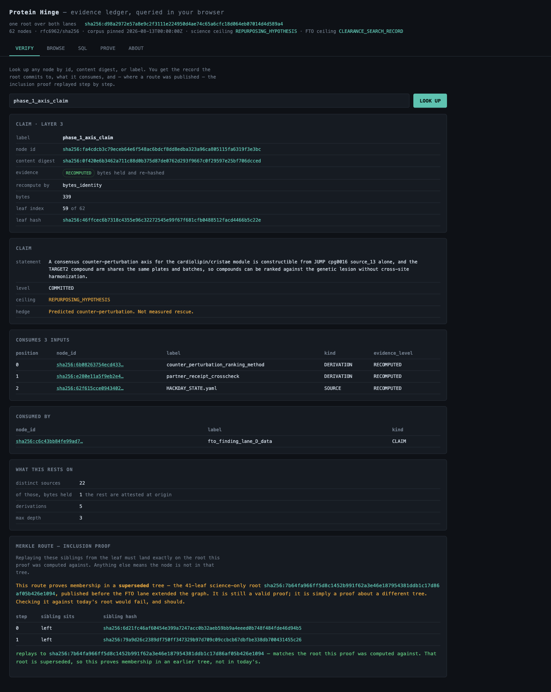
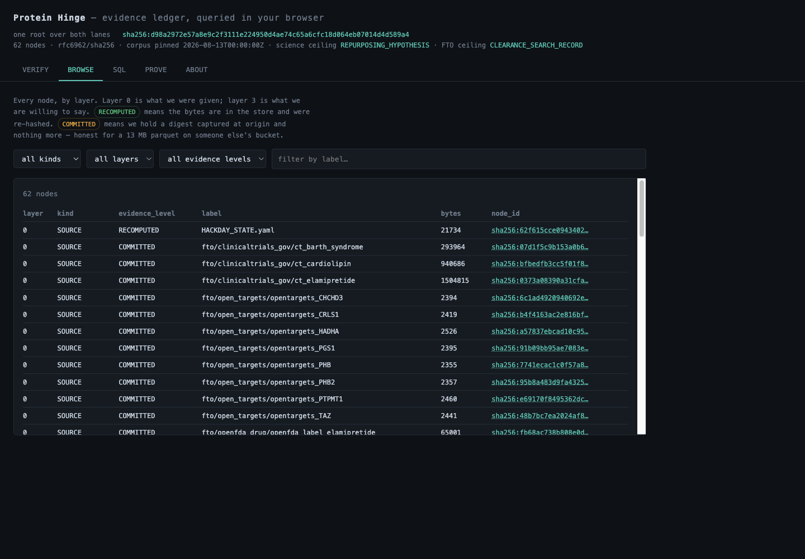
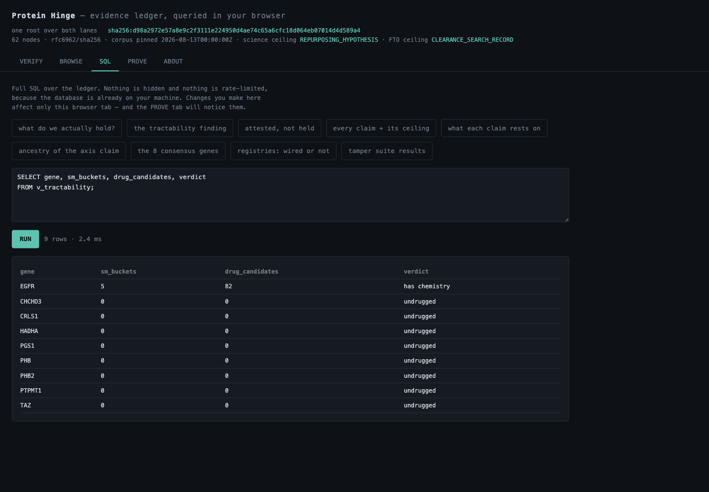
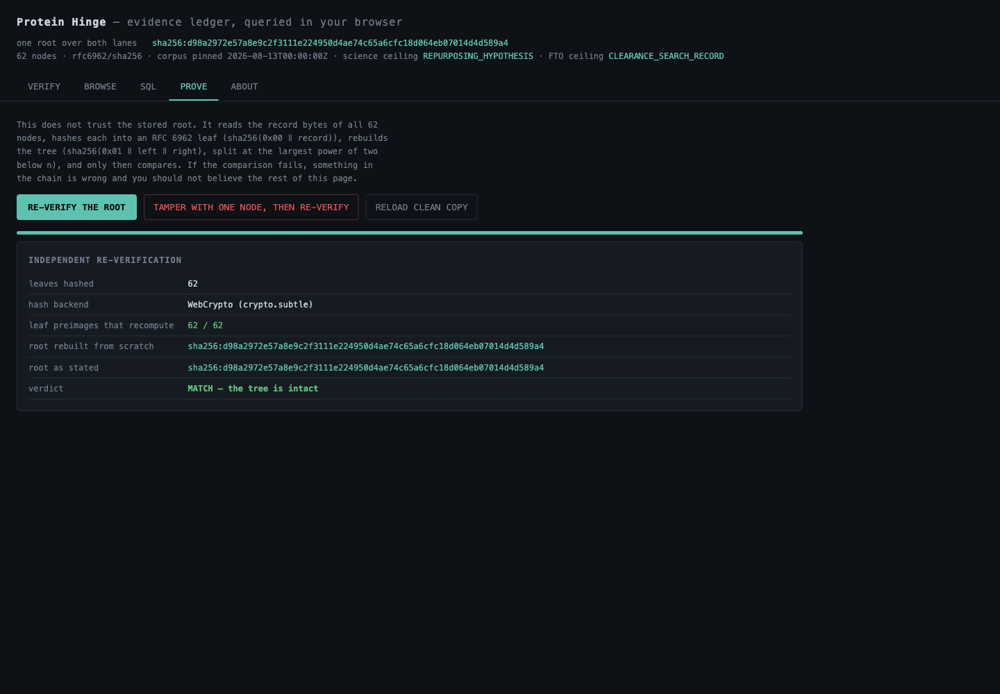
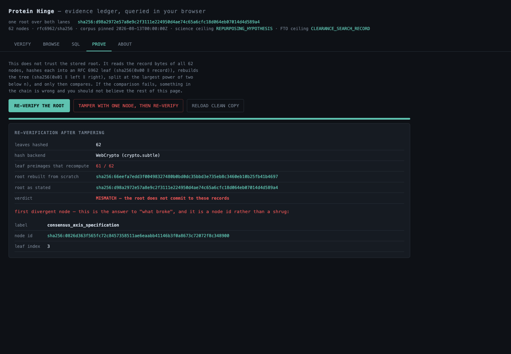

# Protein Hinge Pitch Deck

## Slide 1 — Protein Hinge

**A hash-pinned evidence ledger for phenotype-first repurposing hypotheses.**

One root covers two lanes: the science evidence chain and the clearance-search
record beside it.

## Slide 2 — Problem

Biology demos often end with an attractive ranking but a weak evidence trail.
The hard questions come immediately:

- What public data did this use?
- Which records support this claim?
- Which calculations were recomputed versus merely attested?
- Can another scientist detect a changed record?

## Slide 3 — MVP

Protein Hinge packages a minimal vertical slice:

- JUMP / Cell Painting profile evidence
- A consensus perturbation-axis claim
- Candidate-ranking provenance pinned as partner evidence
- FTO/search evidence beside the science lane
- One RFC 6962 Merkle root over the combined graph
- A browser dashboard that verifies the chain locally

## Slide 4 — Dashboard

The dashboard is intentionally simple:

- Verify any node by label or hash
- Browse all 62 nodes by layer and evidence level
- Query the local SQLite projection directly
- Rebuild the Merkle root in the browser
- Demonstrate tamper failure in memory

## Slide 5 — What Is Verifiable

The proof tab does not trust the stored root. It hashes all node records into
RFC 6962 leaves, rebuilds the tree, and compares the result with the committed
root.

Current result:

- 62 / 62 leaves recompute
- Current route replays to the current root
- Stale route is preserved and marked as stale
- Root matches `sha256:d98a2972e57a8e9c2f3111e224950d4ae74c65a6cfc18d064eb07014d4d589a4`

## Slide 6 — Tamper Demo

The tamper button changes one node record in the browser's in-memory database.
The rebuilt root moves, the stated root no longer matches, and the first
divergent node is identified.

This is the core custody claim: a changed evidence record is detectable without
trusting a server.

## Slide 7 — Guardrails

The project keeps claim ceilings explicit:

- Science ceiling: `REPURPOSING_HYPOTHESIS`
- FTO ceiling: `CLEARANCE_SEARCH_RECORD`
- The FTO lane refuses `FTO_OPINION`
- The demo does not claim treatment, efficacy, clinical actionability, or
  measured rescue

## Slide 8 — Ask

Use Protein Hinge as the custody layer for phenotype-first discovery demos:

- Publish small, inspectable evidence packages
- Separate recomputed evidence from origin-attested evidence
- Keep FTO/search records beside science claims
- Make tamper detection visible during the demo
