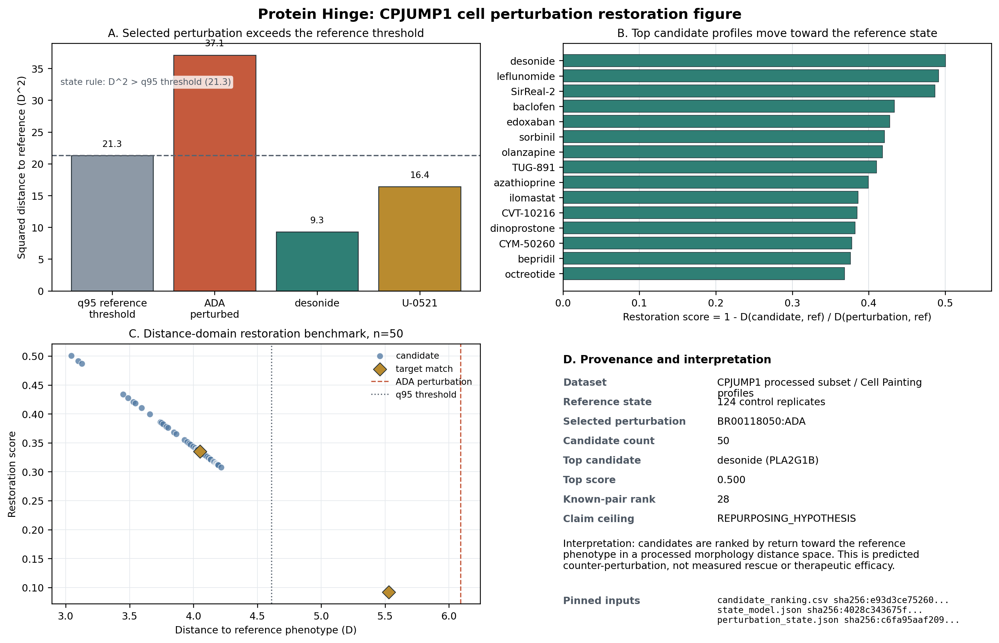
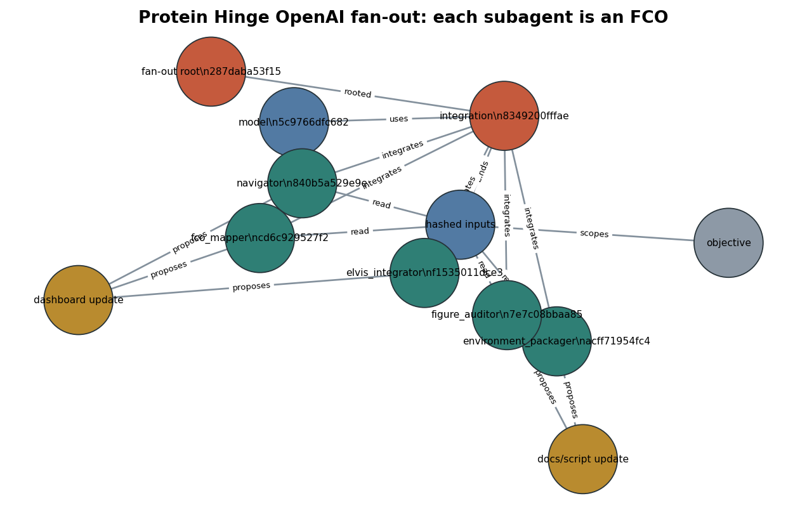

# Protein Hinge Pitch Deck

## Slide 1 — Protein Hinge

**A disease-first repurposing demo with phenotype evidence and hash-pinned
custody.**

One root covers two lanes: the science evidence chain and the clearance-search
record beside it.

## Slide 2 — Problem

Biology demos often end with an attractive ranking but a weak evidence trail.
The hard questions come immediately:

- What public data did this use?
- Which records support this claim?
- Which calculations were recomputed versus merely attested?
- Can another scientist detect a changed record?

## Slide 3 — MVP

Protein Hinge packages a minimal vertical slice:

- JUMP / Cell Painting profile evidence
- A consensus perturbation-axis claim
- Elvis rare-disease prescripted validation and live ClinicalTrials probe
- Candidate-ranking provenance pinned as partner evidence
- OpenAI model, subagent, and integration FCO receipts
- FTO/search evidence beside the science lane
- One RFC 6962 Merkle root over the combined graph
- A browser dashboard that verifies the chain locally

## Slide 4 — Elvis Component

The first screen is disease-first:

- Input: rare disease or target
- Prescripted case: Barth syndrome
- Validation result: elamipretide is already tried/covered
- Deterministic grade: `G004_ALREADY_TRIED / NOT_A_GAP`
- Live option: ClinicalTrials.gov condition probe
- Full gap grading abstains until Open Targets and Convoke are wired

Claim ceiling: `REPURPOSING_HYPOTHESIS`.

## Slide 5 — Scientific Figure

The cell-perturbation figure shows the processed CPJUMP1 result directly:

- ADA selected as the shifted perturbation
- Empirical q95 reference threshold
- 50 candidate profiles ranked by restoration score
- Candidate distance to reference phenotype
- Target-match markers and pinned input hashes

This is a distance-domain morphology benchmark, not a PCA reconstruction and
not measured rescue.

## Slide 6 — Agent FCO Integration

The OpenAI fan-out is itself in custody:

- Each subagent response is a Fractal Custody Object
- The OpenAI model used for the run is a Fractal Custody Object
- The integration record tying the outputs into the dashboard is a Fractal
  Custody Object
- The objects are projected into `fco_object` and `fco_edge` tables in the demo
  database
- The API key is read from local `.env` and is not committed or hashed

## Slide 7 — Dashboard

The dashboard is intentionally simple:

- Verify any node by label or hash
- Run the Elvis prescripted and live demo options
- Inspect the OpenAI fan-out FCO graph
- Browse all 62 nodes by layer and evidence level
- Query the local SQLite projection directly
- Rebuild the Merkle root in the browser
- Demonstrate tamper failure in memory

## Slide 8 — What Is Verifiable

The proof tab does not trust the stored root. It hashes all node records into
RFC 6962 leaves, rebuilds the tree, and compares the result with the committed
root.

Current result:

- 62 / 62 leaves recompute
- Current route replays to the current root
- Stale route is preserved and marked as stale
- Root matches `sha256:d98a2972e57a8e9c2f3111e224950d4ae74c65a6cfc18d064eb07014d4d589a4`

## Slide 9 — Tamper Demo

The tamper button changes one node record in the browser's in-memory database.
The rebuilt root moves, the stated root no longer matches, and the first
divergent node is identified.

This is the core custody claim: a changed evidence record is detectable without
trusting a server.

## Slide 10 — Guardrails

The project keeps claim ceilings explicit:

- Science ceiling: `REPURPOSING_HYPOTHESIS`
- FTO ceiling: `CLEARANCE_SEARCH_RECORD`
- The FTO lane refuses `FTO_OPINION`
- The demo does not claim treatment, efficacy, clinical actionability, or
  measured rescue
- The live Elvis option does not claim full Convoke/Open Targets integration
  until that path is visibly wired and reproducible

## Slide 11 — Citations

- Fractal Custody Objects v4/v5 publication package:
  https://doi.org/10.5281/zenodo.21829929
- Custody-Verified Classification of AI Model Outputs:
  https://doi.org/10.5281/zenodo.21830287
- Shadow Dogma governed computational evidence package:
  https://doi.org/10.5281/zenodo.21830361
- XenoDisorder bounded evidence package:
  https://doi.org/10.5281/zenodo.21830386
- RFC 6962 Merkle audit tree convention:
  https://www.rfc-editor.org/rfc/rfc6962.html
- MMR diversity reranking:
  https://doi.org/10.1145/290941.291025

## Slide 12 — Ask

Use Protein Hinge as the custody layer for phenotype-first discovery demos:

- Publish small, inspectable evidence packages
- Separate recomputed evidence from origin-attested evidence
- Keep FTO/search records beside science claims
- Make tamper detection visible during the demo
